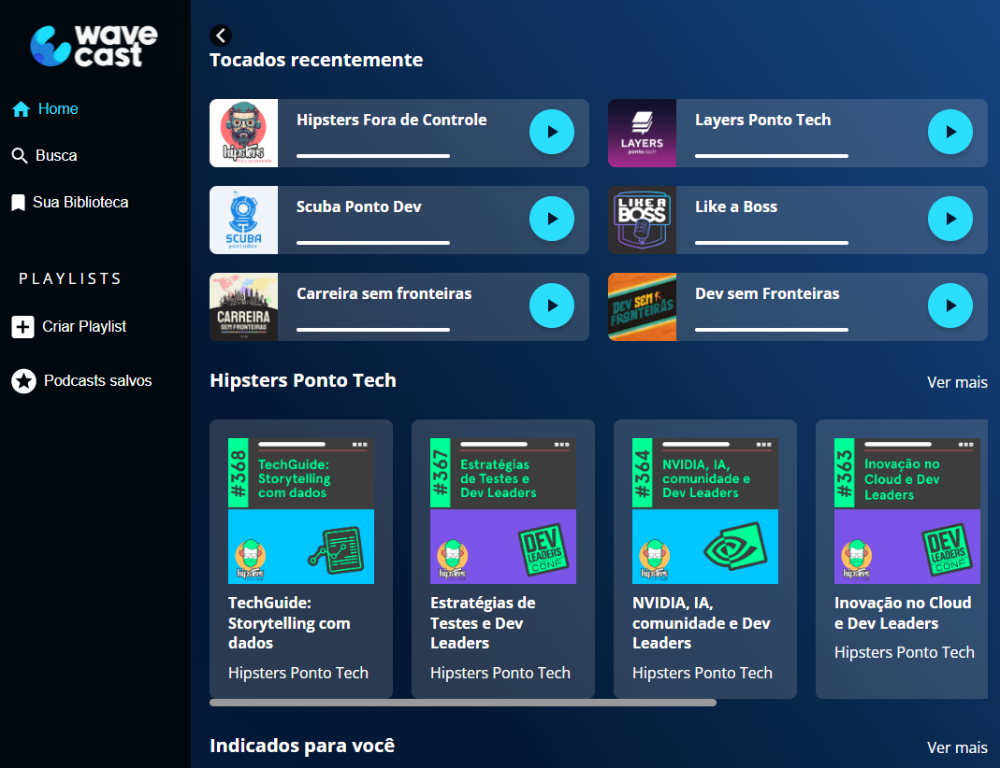

# Wave Cast


Wave Cast é uma página estática com tema de podcast desenvolvida para explorar as funcionalidades do Flexbox e Grid no frontend do curso "CSS: construindo layouts com Grid" da Alura.

## Funcionalidades

- Layout responsivo usando Flexbox para a estrutura geral da página.
- Utilização do Grid para organizar e posicionar elementos específicos da página.
- Componentes customizados para reprodução de episódios de podcast.
- Design minimalista e moderno.
  
## Tecnologias Utilizadas

- HTML5
- CSS3 (Flexbox e Grid)
  
## Instalação e uso

Siga os passos abaixo para configurar o ambiente de desenvolvimento local:

1. Clone o repositório:

    ```bash
    git clone https://github.com/Chikrem/wave_cast.git
    ```

2. Abra o arquivo index.html em seu navegador web.

## Teste

O projeto pode ser visualizado em:

- [Vercel](https://wave-cast-iota.vercel.app/)

## Screenshots



